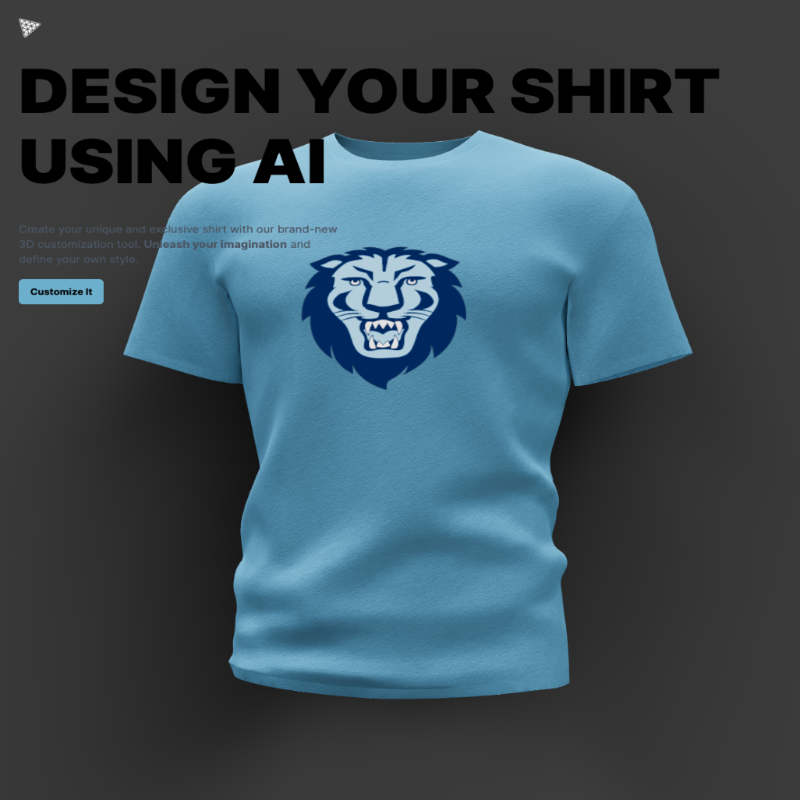

# AI-Powered 3D T-Shirt Design Website



Welcome to the AI-Powered 3D T-Shirt Design Website repository! This project leverages the power of artificial intelligence and creative technologies to allow users to design custom t-shirts. It uses Three.js for 3D rendering, React with Vite.js for the frontend, Midjourney for user interactions, and integrates DALL·E AI for generating unique t-shirt designs.

## Demo

You can experience the AI-Powered 3D T-Shirt Design Website live here: [Live Demo](https://github.com/seansangpark/threejs)

## Technologies Used

- **React with Vite.js**: The project is built using React for the frontend, with Vite.js for fast development and building.
- **Three.js**: Three.js is used for 3D rendering, creating an interactive and visually appealing user experience.
- **Midjourney**: Midjourney is employed for handling user interactions and enhancing the user interface.
- **DALL·E AI**: DALL·E AI is integrated to generate creative and unique t-shirt designs based on user input.

## Features

- Interactive 3D Design: Users can interact with and customize t-shirt designs in a 3D environment.
- AI-Powered Design Suggestions: DALL·E AI suggests creative t-shirt design ideas based on user preferences.
- Fast Development: Vite.js ensures quick development and a smooth development experience.
- User-Friendly Interface: Midjourney simplifies user interactions, making the design process intuitive.

## Usage

To run this project locally, follow these steps:

1. Clone the repository:

   ```bash
   git clone https://github.com/seansangpark/threejs.git

2. Navigate to the project diretory

   ```bash
   cd threejs

3. Install dependencies:

   ```bash
   npm install

4. Start the development server:

   ```bash
   npm run dev

5. Open your web browser and visit http://localhost:3000 to explore the AI-powered 3D t-shirt design website

## Contributing

We welcome contributions! If you'd like to contribute to this project, please follow these steps:

1. Fork the repository to your GitHub account.
2. Create a new branch for your feature or bug fix.
3. Make your changes and commit them with clear commit messages.
4. Push your changes to your forked repository.
5. Submit a pull request to the main repository.

## Contact

If you have any questions or need further assistance, feel free to contact me at seansangpark@gmail.com.

Thank you for exploring my AI-Powered 3D T-Shirt Design Website!
